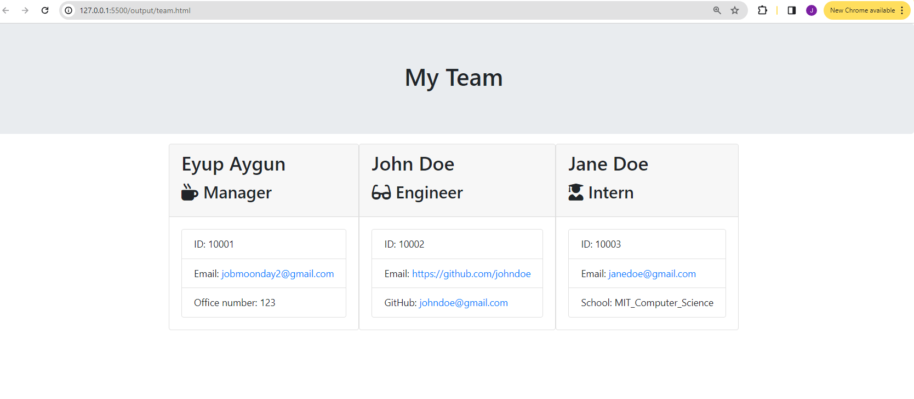

# Team_Profile_Generator

## Description

The application generates a basic team profile html page using the prompts from the user.

## Table Of Content

- [EngineeringTeam](#engineeringteam)
  - [Description](#description)
  - [Table Of Content](#table-of-content)
  - [Installation](#installation)
  - [Usage](#usage)
  - [Contributing](#contributing)
  - [Tests](#tests)
  - [Screenshoot](#screenshoot)
  - [Links](#links)
  - [Questions](#questions)

  
## Installation

Install packages from npm with “npm install fs –save” and  “npm install inquirer –save”

## Usage

The application is invoked by using the following command in CLI: ”node index.js”

## Contributing

Your contributions to this project are welcome. Please feel free to submit bugs and feature suggestions. Please help us verify as they are submitted, review the source code updates, the documentation and make pull requests for any contributions you make.

## Tests

Test the application by typing “node index.js” on the terminal, respond the questions and it generates a team.html file. Then verify if the file is in the output folder in project.

## Screenshoot

## Links

- [https://github.com/jobmoonday/Team_Profile_Generator](https://github.com/jobmoonday/Team_Profile_Generator)
  
## Questions

Any question please contact:
- https://github.com/jobmoonday
- jobmoonday2@gmail.com